# UFOs
UFO Sightings with JavaScript

## Project Outline
Along with an interactive webpage, this project analysis includes a descriptive summary of the process to filter results thereon, in addition to a critique how the design may be improved.

### Background
"Dana," a moderately established data journalist A, has an opportunity to return to her hometown of McMinnville, Oregon for reporting on a locally-based topic for which McMinnville is well-known and that had piqued her interest from years ago — UFOs !   Building — in more than one sense — on knowledge of JavaScript, HTML, and CSS, this project provides for introducing, learning and combining multiple skills and intriguing pursuits into an engaging, thought-provoking, well-blended page.

A as presented in the Module 11.0.4 video.

### Results
Images depicting areas of the webpage are included below, in particular to accompany the following description of how to utilize filtering features.

1. The first image is a snapshot overview of the appearance of the page (to be noted here is the inclusion of a NASA image for the background near the top). 
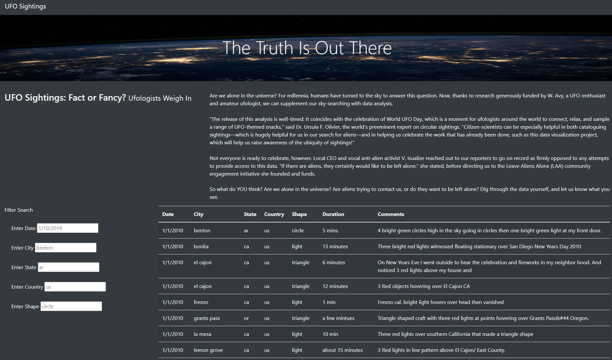  
2. In the second image, of note is the "Filter Search" set of entry boxes along the left of the page. These correspond to the first five columns of data in the table, and accept inputs — *"placeholder" defaults are included for input-formatting guidance* — that will subsequently filter information appearing in the accompanying table to the right. 
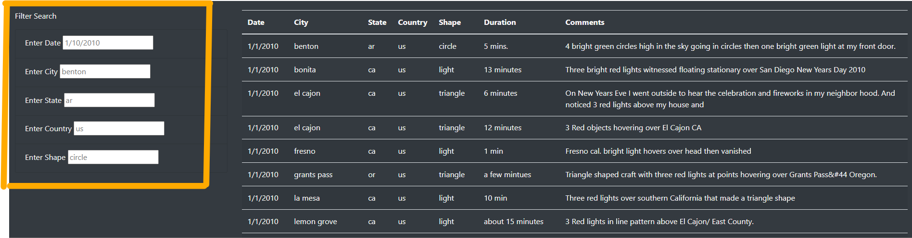  
3. The *page may be scrolled* for reviewing more table results; data from over 100 sightings is included in the full set. 
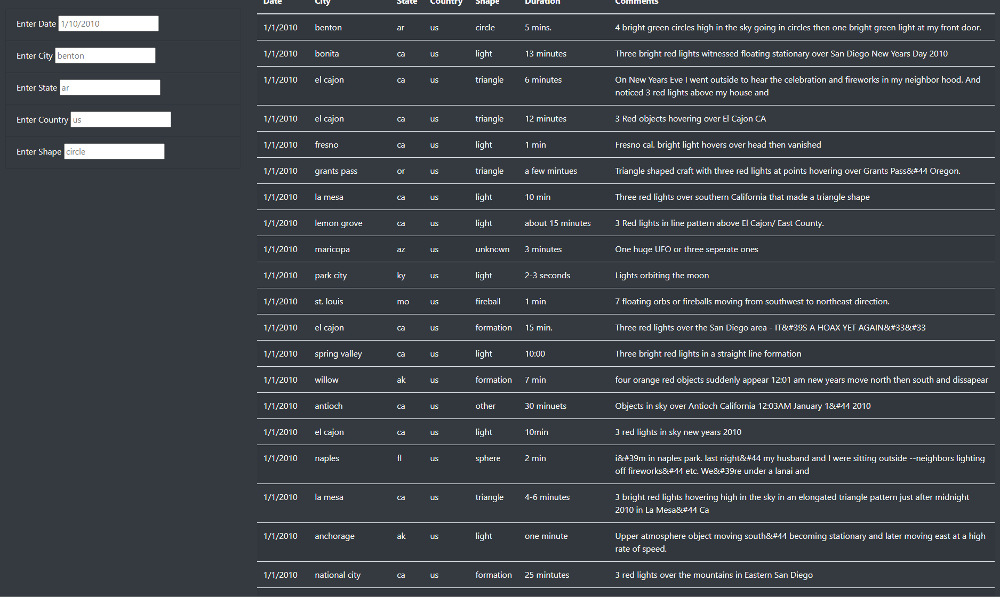 
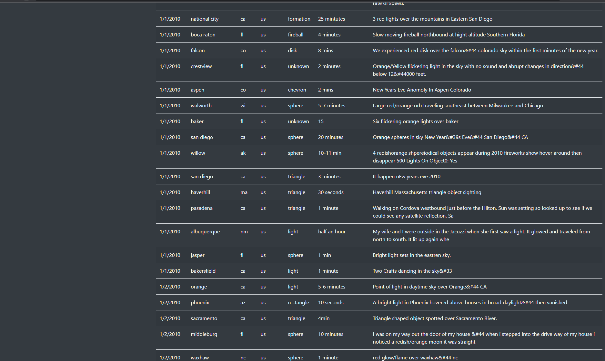  
4. For inputs, note that the "placeholder" defaults *do not* initially filter out any of the results, and also note any or all of the five filter boxes may be populated for filtering purposes. Text input into the boxes may also be erased with the backspace key to remove particular filters that were previously entered (using the "Enter" key on a keyboard — i.e., no mouse clicks for entry). For another note, the text is case-sensitive. Finally, note that the *"NavBar"* near the top left of the page that may be used (or also a browser refresh) to at-a-click reset the table to initial unfiltered status. 
< Filter State Code `wa` >: 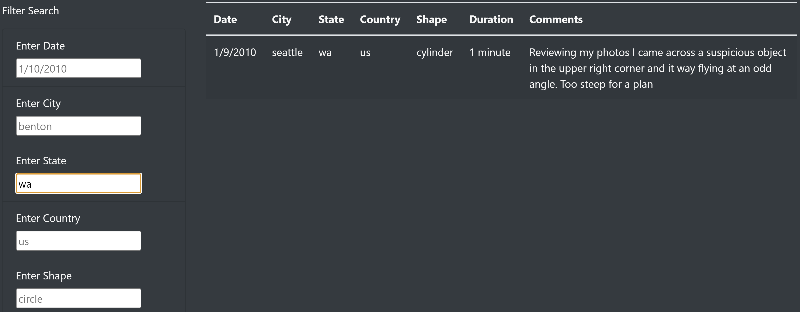  
< Filter State Code `WA` >: 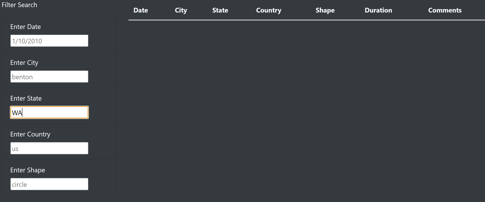  
< Filter State Code `or` >: 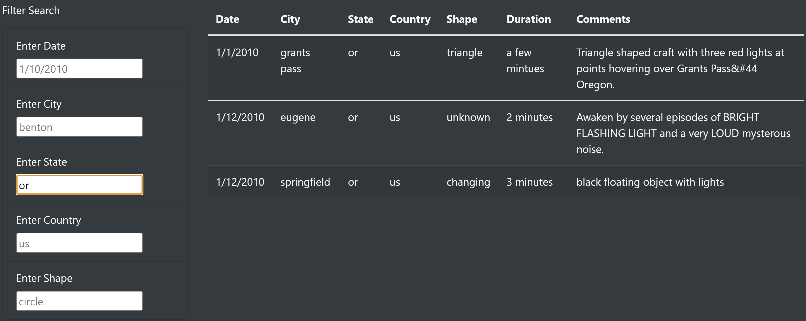  
< Filter State Code `or` and Date >: 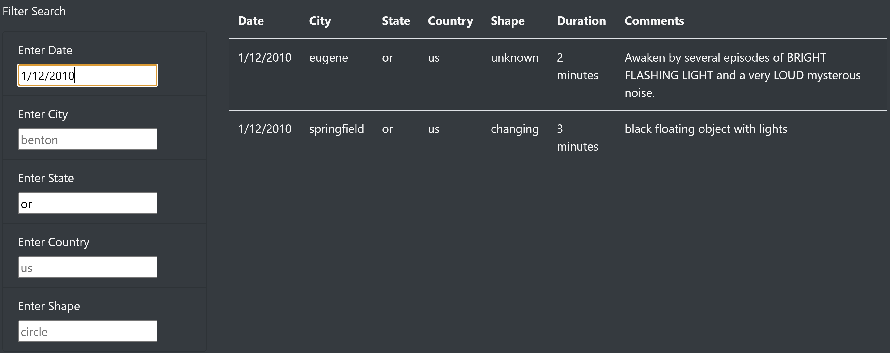  
< Filter State Code `or` and Date and Shape >: 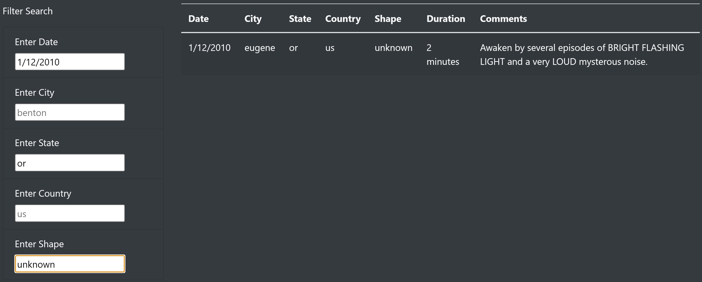  
< Remove State and Date Filters >: 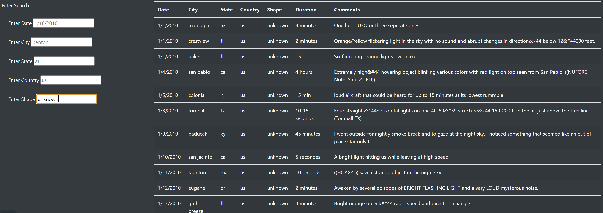  
< Refresh with *NavBar* click >: 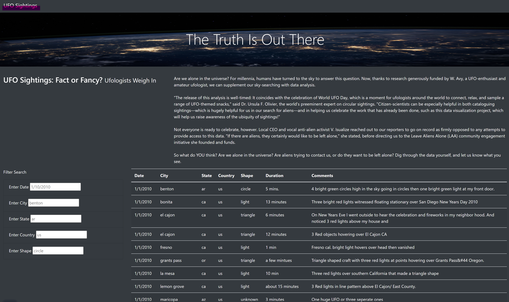  
5. The page components shift and resize to accommodate different shapes and sizes of browser windows. 
.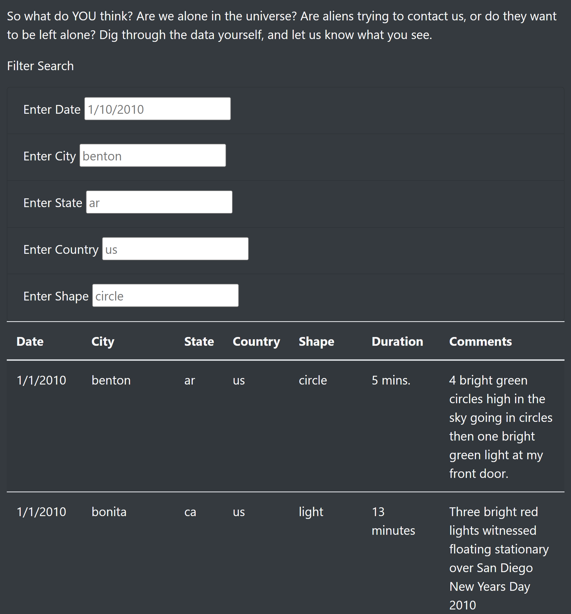.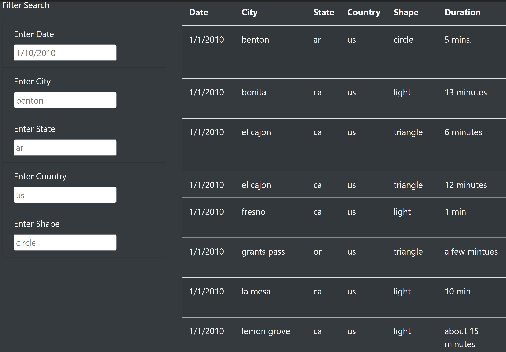.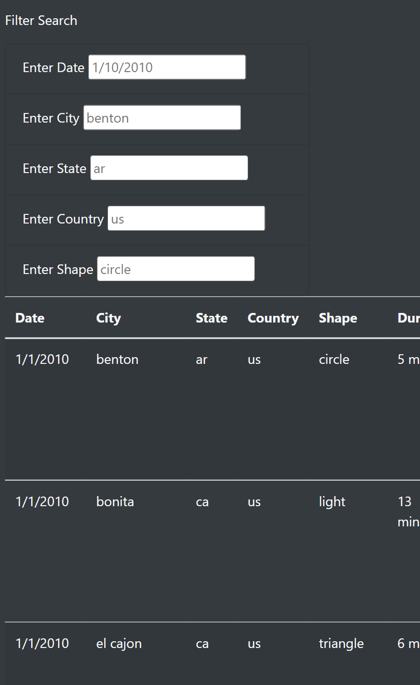. 
---

### Summary
While the page is well-designed and has several features added, particularly for filtering the sightings data displayed in the table, there are a number of drawbacks or missing customizations. 

- Breadth of Data 
    - When the page is resized to smaller sizes, it can be unwieldy to scroll through to view the displayed table, or to see the font if made to fit the smaller screen size. 
        - A way to ameliorate this difficulty is to put scroll bars along the edges of the table.  
- Case Sensitivity 
    - As noted in Results item (4) above, the input is case-sensitive, as well as requiring an exact match for the input box to the table data. Thus, neither partial matches nor range-matching is available in the current implementation of the webpage.
        - Any of these features could be recommended to be made available as a future improvement.  
< Country Code `ca` for Canada >   :   < city of `london` in Canada no match >   :   < needs `london (canada)` to be specified >
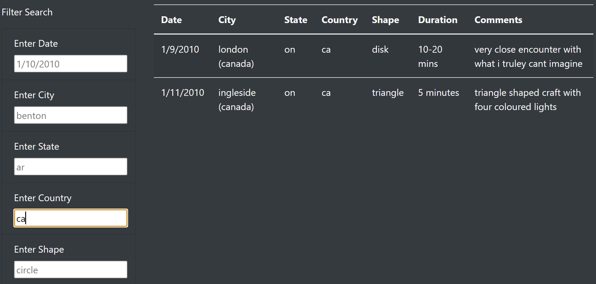.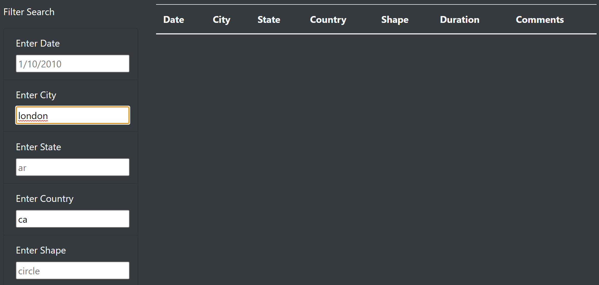.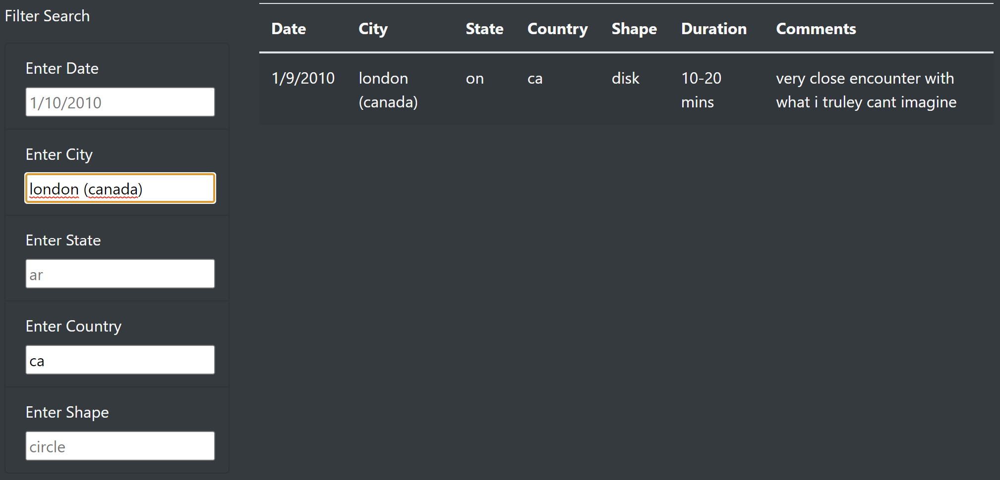
---

#### Project Tools
Software 
+–––––+
- Microsoft VSCode
- Google Chrome Browser, including Developer Tools
- D3.js JavaScript library
- HTML; CSS, Bootstrap CDN Stylesheet

#### Coding Notes
To be well-appreciated is the lack of software installation snafus (as had accompanied the prior module), as ubiquitous browser tools were utilized throughout this project.

- A storyboard for layout "blueprint" prior to coding was also used in the project, as also was done for prior module.
- The .html and .js files were coded in tandem, having several integrated elements between them.
- A standard directory structure was established for placing requisite necessary files.
- The data is included in a .js file in appropriate location in the directory structure, as is a .css stylesheet.
